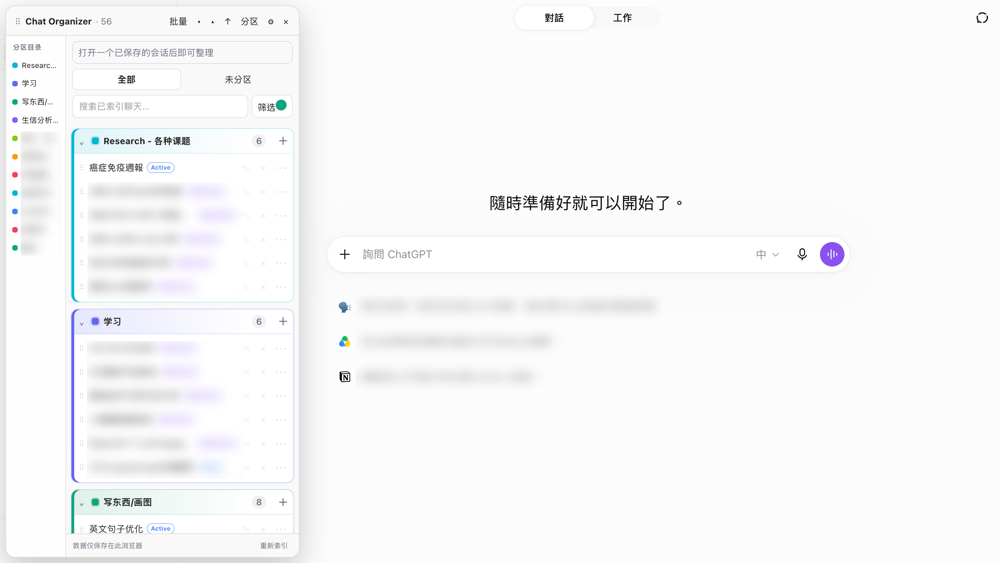

# ChatGPT Sidebar Organizer

**English** | [简体中文](README.zh-CN.md)

ChatGPT Sidebar Organizer is an unofficial userscript for organizing ChatGPT conversations in a movable on-page panel. It adds custom sections, independent status tags, search, filters, drag-and-drop ordering, and local backup tools without changing conversation content unless you explicitly use the rename or delete actions.

Version: **2.2.0**

## Highlights

- Create your own color-coded sections; no preset sections are imposed.
- Assign an optional status: `Active`, `Reference`, `Backlog`, or no status.
- Drag conversations to define a custom order within each section.
- Drag sections to reorder them.
- Search and filter by section, status, and conversation type.
- Batch-organize only conversations that are currently unsectioned.
- Create a new ChatGPT conversation directly from a section.
- Rename or delete standard ChatGPT conversations from Organizer.
- Keep Project conversations out of Organizer while remembering their previous section.
- Export and import local JSON backups.
- Move the Organizer window anywhere on the page.

## Installation

1. Install [Tampermonkey](https://www.tampermonkey.net/) in Chrome or Edge, or Tampermonkey/Violentmonkey in Firefox.
2. Open the userscript manager dashboard and create a new script.
3. Delete the template code.
4. Choose one language and copy the complete contents of its userscript into the editor:
   - English: `chatgpt-sidebar-organizer.user.js`
   - Simplified Chinese: `chatgpt-sidebar-organizer.zh-CN.user.js`
5. Save the script and reload `https://chatgpt.com/`.

An `Organizer` panel will appear on the page. Drag its title bar to move it, or use `×` to collapse it into a small launcher.

## Quick start

1. Select **Sections** and create one or more sections.
2. Select **Reindex** to collect conversations that ChatGPT has loaded into its native history list.
3. Open a conversation and select the current-conversation card, or use `•••` on a row, to assign a section and status.
4. Use the drag handle `⠿` to reorder conversations or sections.
5. Use **⚙ → Export JSON backup** before clearing browser data or moving to another browser.

See [manual.md](manual.md) for complete usage instructions and [AUDIT_REPORT.md](AUDIT_REPORT.md) for the performance and robustness review.

## Bilingual support

The project provides separate English and Simplified Chinese userscripts, READMEs, and manuals. Both userscripts contain the same v2.2.0 functionality, performance changes, storage schema, and safety checks. They also recognize several localized ChatGPT labels when synchronizing native actions.

Both variants use the same local storage key, so switching from one language to the other preserves existing Organizer sections, statuses, ordering, and indexed metadata. Disable or remove the old language variant before enabling the other one. Do not run both userscripts at the same time.

Documentation:

- English: [README.md](README.md) and [manual.md](manual.md)
- 简体中文: [README.zh-CN.md](README.zh-CN.md) and [manual.zh-CN.md](manual.zh-CN.md)

## Data and privacy

Organizer metadata is stored in `localStorage` for the current ChatGPT domain. It includes conversation titles, URLs, section assignments, statuses, ordering, and panel settings. It does not store conversation messages.

The script does not send Organizer metadata to a separate server. Rename and delete are the only actions that intentionally modify ChatGPT account data; they use ChatGPT's own web endpoints and require an active signed-in session.

## Compatibility and limitations

- ChatGPT is a frequently changing web application. This script prefers stable conversation URL patterns over generated CSS class names, but future ChatGPT changes may still require updates.
- Reindexing can only collect conversations that the native ChatGPT history interface actually loads.
- Search covers indexed conversation titles, not message content.
- Rename and delete rely on ChatGPT's internal web endpoints, which are not a public API.
- Work/Codex URL formats may change. Direct rename/delete currently supports standard ChatGPT conversations only.

## Forking, customization, and issues

Anyone may fork this project and adapt or optimize the script for their own workflow.

Issue handling is intentionally limited. Unless an issue describes a reproducible bug, regression, security/privacy problem, or a substantial improvement, it is unlikely to be addressed. Small preference changes and highly individual workflow requests are better implemented in a personal fork.

## Repository files

- `chatgpt-sidebar-organizer.user.js` — installable userscript and source code
- `chatgpt-sidebar-organizer.zh-CN.user.js` — Simplified Chinese userscript and source code
- `README.zh-CN.md` — Simplified Chinese project overview
- `manual.md` — complete feature and usage guide
- `manual.zh-CN.md` — complete Simplified Chinese usage guide
- `AUDIT_REPORT.md` — performance, listener, memory, and robustness assessment
- `tests/robustness.test.cjs` — dependency-free Node.js robustness checks
- `tests/bilingual-parity.test.cjs` — structural parity checks for both language variants

## Uninstalling

Disable or remove the script in your userscript manager. To remove Organizer metadata as well, first use **⚙ → Clear Organizer data**, or clear site data for ChatGPT in the browser.

## Disclaimer

This is an unofficial community project and is not affiliated with or endorsed by OpenAI.
